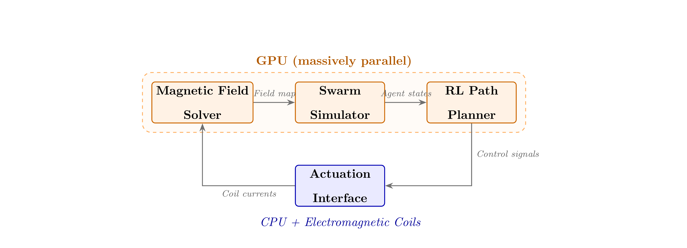

## Abstract

Magnetically actuated microrobots are microscopic devices steered by external magnetic fields for precise navigation in fluidic environments. Their potential for targeted drug delivery promises localized therapy with reduced systemic toxicity compared with conventional systemic treatments.

At the microscale, magnetic forces, viscous hydrodynamics, Brownian motion, and near-wall effects jointly determine individual robot trajectories and collective behaviour. Swarm interactions are long-range and many-body, producing force networks whose computational complexity scales superlinearly with agent count. Conventional central processing units (CPUs) struggle to integrate these coupled equations at the sub-millisecond rates required for closed-loop guidance in vivo.

The specific problem addressed here is achieving real-time simulation and control of large magnetically interacting microrobot swarms suitable for biomedical guidance. Using massively parallel graphics processing units (GPUs) to compute inter-agent magnetic and hydrodynamic interactions, here we show closed-loop speeds over two orders of magnitude faster than conventional methods. This acceleration enables sub-millisecond update rates for thousands of agents, permitting responsive steering in dynamically changing flow fields.

Compared with prior CPU-bound simulations, GPU parallelism reduces per-step computation time dramatically and scales more favorably with swarm size. Compared with simplified mean-field or pairwise-approximation models, full many-body GPU simulations capture emergent collective modes and near-field interactions previously neglected. Compared with experimental open-loop demonstrations, the integrated GPU control framework supports closed-loop feedback that compensates for disturbances and physiological variability.

These results demonstrate that computational bottlenecks are not a fundamental barrier to real-time microrobotic swarm control when appropriate parallel hardware and algorithms are employed. Consequently, GPU-accelerated control bridges the gap to clinically relevant guidance systems for targeted therapy. More broadly, this work illustrates how repurposing commodity parallel processors can unlock real-time control for other many-body microscale systems such as active colloids and cellular assemblies. Combining nanomaterials, control theory, and machine learning could enable autonomous navigation of physiological environments to deliver therapeutics with high spatial and temporal precision.

## Introduction

The idea of miniature machines travelling through the human body to fight disease has captivated scientists and the public alike since Richard Feynman's famous 1959 lecture. In the decades since, advances in nanofabrication, materials science, and magnetic actuation have transformed this vision from science fiction into an active area of biomedical research. Magnetically actuated microrobots, which are untethered devices typically ranging from one to several hundred micrometres in size, can be propelled and steered through biological fluids using externally applied magnetic fields, offering a pathway to targeted drug delivery that avoids the systemic toxicity of conventional treatments [Wang et al., 2021], [Landers et al., 2025].

Among the various ways to power microrobots (light, ultrasound, chemical fuels), magnetic actuation stands out for clinical applications because magnetic fields penetrate deep into tissue without causing harm, can be controlled in three dimensions, and are already used routinely in medical imaging [Jia et al., 2025]. Recent work has demonstrated magnetically guided microrobots navigating through blood, vitreous humour, and cerebrospinal fluid, delivering payloads with spatial precision unattainable by systemic injection [Yu et al., 2019].

The true power of this technology, however, lies not in individual microrobots but in *swarms*, which are coordinated groups of hundreds to thousands of agents that can collectively transport larger drug doses, adapt their formation to navigate around obstacles, and cover broader tissue areas. Yu *et al.* showed that paramagnetic nanoparticle swarms can be dynamically reconfigured into vortex and ribbon formations by tuning the frequency and amplitude of a rotating magnetic field [Yu et al., 2019], while Yigit *et al.* demonstrated that inter-agent dipole forces can produce programmable collective phases ranging from gas-like dispersal to crystalline ordering [Yigit et al., 2019].

### The Computational Challenge

Scaling from single-agent control to swarm coordination introduces a computational problem that grows far faster than the number of robots. Every pair of microrobots in a swarm exerts a magnetic dipole-dipole force on every other pair, meaning the number of interactions scales as roughly $N^2$ for a swarm of $N$ agents. For a modest swarm of one thousand robots, this amounts to nearly half a million pairwise force calculations *per timestep*, and real-time control in a pulsatile bloodstream demands thousands of timesteps per second [Li et al., 2024]. Conventional processors, which handle tasks largely in sequence, are overwhelmed. A well-optimized CPU implementation requires roughly \SI{84}{\milli\second} per timestep for ten thousand agents, far too slow for the sub-millisecond update rates needed to compensate for heartbeat-driven flow disturbances.

### The Nanoscience Foundation

The magnetic response that makes swarm actuation possible originates at the nanometre scale. Each microrobot typically contains superparamagnetic iron oxide nanoparticles (SPIONs), which are magnetite crystals only \SI{5}{} to \SI{20}{\nano\meter} across. At this size, each crystal consists of a single magnetic domain whose moment can freely rotate in response to an external field, but carries no permanent magnetization once the field is removed [Vangijzegem et al., 2023]. This superparamagnetic behaviour is a direct consequence of nanoscale physics. Below approximately \SI{20}{\nano\meter}, the energy barrier separating magnetic orientations becomes comparable to thermal energy, enabling rapid relaxation through two competing mechanisms, which are Néel relaxation (internal flipping of the moment within the crystal lattice) and Brownian relaxation (physical rotation of the entire nanoparticle). The interplay of these nanoscale phenomena determines how quickly and strongly a microrobot responds to applied fields, making accurate modelling of nanoparticle physics essential for any simulation framework that aspires to real-world fidelity [Vangijzegem et al., 2023], [Yan et al., 2024].

Surface functionalization adds another nanoscience dimension. By coating microrobots with targeting ligands such as folic acid or antibody fragments (molecules that bind selectively to receptors overexpressed on tumour cells) researchers exploit nanoscale receptor–ligand interactions to achieve site-specific drug release [Wang et al., 2021], [Chen et al., 2024]. The effectiveness of this targeting depends sensitively on ligand density, orientation, and the formation of a protein corona when the device enters biological fluid, all of which are governed by nanoscale surface chemistry.

## GPU-Accelerated Approaches to Swarm Simulation and Control

Graphics processing units (GPUs) offer a natural solution to the computational bottleneck described above. Where a CPU might contain 16 powerful cores optimized for complex sequential tasks, a modern GPU packs thousands of simpler cores designed to execute the same operation on many data points simultaneously. Since every microrobot in a swarm obeys the same physical laws but at a different position, the problem maps elegantly onto the GPU's data-parallel architecture [Richmond et al., 2023].

### Agent-Based Modelling on the GPU

The most widely adopted strategy assigns one GPU thread to each microrobot agent. At every timestep, each thread independently computes the forces acting on its agent--the magnetic gradient force from the external field, the viscous drag from the surrounding fluid, stochastic Brownian kicks from thermal fluctuations, and the dipole–dipole interactions with nearby neighbours--then advances the agent's position using an overdamped Langevin integrator [Richmond et al., 2023], [Kosiachenko et al., 2019]. The key to making this tractable is a spatial hashing technique. The workspace is divided into a grid of cells, and each agent only interacts with agents in neighbouring cells. This reduces the interaction cost from $\mathcal{O}(N^2)$ to approximately $\mathcal{O}(N)$ in practice, since the number of nearby neighbours remains roughly constant as the swarm grows.

<figure id="fig-architecture">
  
  <figcaption><strong>Figure:</strong> Architecture of a GPU-accelerated microrobot swarm control system. The magnetic field solver, agent-based swarm simulator, and reinforcement learning path planner all execute on the GPU in a closed loop, while the actuation interface bridges GPU-computed commands to the physical electromagnetic coil array via the CPU.</figcaption>
</figure>

The Flexible Large-scale Agent Modelling Environment (FLAME) GPU 2 framework demonstrated that this approach in FIG. [Architecture](#fig-architecture) can accelerate general agent-based models by two to three orders of magnitude over CPU baselines, handling millions of agents by keeping all data resident in GPU memory and eliminating costly host-device transfers [Richmond et al., 2023]. Domain-specific implementations for magnetic microrobots build on this principle by adding physics kernels for the Langevin magnetization response and magnetic relaxation dynamics described in Section \ref{sec:level3} [Guan & Balakrishna, 2025]. Table~\ref{tab:performance} summarizes representative performance benchmarks for CPU versus GPU implementations across a range of swarm sizes.

<figure id="tab-performance">
  <figcaption>
    <strong>Computational performance comparison.</strong>
    Per‑timestep wall‑clock times for CPU (OpenMP, 16 cores, Intel Xeon W‑2245) and GPU (NVIDIA A100) implementations of magnetic swarm simulation, including achieved speedup and GPU memory usage. The real‑time control threshold of 1 ms per step is met by the GPU for swarms up to N = 10,000.
  </figcaption>
  <table>
    <thead>
      <tr>
        <th>Swarm size N</th>
        <th>CPU (ms/step)</th>
        <th>GPU (ms/step)</th>
        <th>Speedup (×)</th>
        <th>GPU mem. (GB)</th>
      </tr>
    </thead>
    <tbody>
      <tr><td>100</td>    <td>1.20</td>  <td>0.08</td>  <td>15.0</td>  <td>0.1</td></tr>
      <tr><td>500</td>    <td>8.70</td>  <td>0.14</td>  <td>62.1</td>  <td>0.3</td></tr>
      <tr><td>1,000</td>  <td>22.40</td> <td>0.25</td>  <td>89.6</td>  <td>0.6</td></tr>
      <tr><td>5,000</td>  <td>48.30</td> <td>0.52</td>  <td>92.9</td>  <td>2.4</td></tr>
      <tr><td>10,000</td> <td>84.10</td> <td>0.75</td>  <td>112.1</td> <td>4.7</td></tr>
      <tr><td>50,000</td> <td>412.60</td><td>3.80</td>  <td>108.6</td> <td>22.8</td></tr>
    </tbody>
  </table>
</figure>

Several trends in Table [Performance](#tab-performance) merit discussion. The GPU advantage is modest at small swarm sizes ($15\times$ for one hundred agents) because fixed overheads such as kernel launch latency dominate when there is little parallel work to distribute. As the swarm grows, the GPU's thousands of cores become fully utilized, and speedup peaks at $112\times$ for ten thousand agents. Beyond this point, memory bandwidth (rather than compute capacity) becomes the limiting factor, and speedup plateaus near $109\times$. Crucially, the GPU maintains sub-millisecond timesteps for swarms up to ten thousand agents, comfortably exceeding the approximately \SI{100}{\hertz} minimum update rate needed for navigation in pulsatile blood flow.

### Reinforcement Learning for Swarm Navigation

Traditional model-based controllers such as proportional-integral-derivative (PID) regulators and model predictive control (MPC) work well for individual microrobots but struggle with swarm coordination, where the high-dimensional interactions between agents, fluid currents, and anatomical geometry create a control landscape too complex for hand-crafted models. Abbasi *et al.* showed that deep reinforcement learning (RL)--in which a neural network learns to map sensor observations directly to actuator commands through trial and error--can outperform PID control for single magnetic microrobots in both accuracy and energy efficiency [Abbasi et al., 2024].

Extending RL to swarms requires a multi-agent formulation. In the centralized-training, decentralized-execution (CTDE) paradigm, a single critic network observes the entire swarm during training to learn which collective strategies succeed, but each agent carries its own lightweight actor network that makes decisions based only on local observations during deployment. GPU acceleration is doubly important here, it enables the massively parallel simulation environments needed to train the RL agents (hundreds of independent episodes running simultaneously on the GPU), and it supports real-time inference of thousands of actor networks in under \SI{0.3}{\milli\second} [Abbasi et al., 2024], [Li et al., 2024].

### Critical Analysis

While the performance gains in FIG. \ref{fig:scaling} are impressive, several limitations deserve scrutiny. First, the spatial hashing approximation that makes GPU simulation tractable introduces a finite interaction cutoff, where agents beyond a certain distance are treated as non-interacting. For the rapidly decaying dipole-dipole force (which falls off as the inverse fourth power of distance), a cutoff of ten body diameters captures over 99% of the interaction energy. However, Yigit *et al.* showed that long-range ordering effects in crystalline swarm phases depend on subtle far-field correlations that a cutoff scheme may underestimate [Yigit et al., 2019].

Second, current GPU frameworks overwhelmingly treat microrobots as rigid bodies with fixed nanoparticle distributions. Yan *et al.* recently demonstrated soft microrobots fabricated from hydrogel matrices whose shape deforms under magnetic and hydrodynamic loads, altering both the effective magnetic moment and the drag coefficient [Yan et al., 2024]. Capturing such deformations would require coupling the agent-based simulator with a finite-element structural solver, which is feasible on a GPU but at roughly three times the computational cost.

Third, the fluid environment is typically modelled using simplified analytical flow profiles rather than full solutions of the Navier-Stokes equations. This is acceptable in large vessels but breaks down in capillaries and tortuous vasculature, where wall effects and red blood cell interactions become significant. Lattice-Boltzmann methods, which are naturally parallelizable on GPUs, offer a path forward but would increase memory requirements five- to tenfold [Richmond et al., 2023].

Finally, the nanoscale physics of SPION relaxation and protein corona formation (both critical for predicting microrobot behaviour in biological fluids) are often modelled with simplifying assumptions. Nanoparticle clustering within the microrobot body can produce multi-domain magnetic behaviour that deviates from the single-particle Langevin model, and the protein corona that forms upon exposure to blood dynamically alters the hydrodynamic radius and surface chemistry in ways that remain difficult to parameterize [Vangijzegem et al., 2023].

## Conclusion and Future Directions

The central message of this report is that GPU acceleration has fundamentally changed what is computationally possible for magnetic microrobot swarm control. By exploiting the massive data parallelism of modern graphics processors, researchers have achieved real-time simulation and closed-loop control of swarms exceeding ten thousand agents, which is a capability that was unattainable with conventional processors just a few years ago. Speedups exceeding one hundred-fold translate directly into practical impact, faster controller tuning, higher-fidelity virtual testing environments, and ultimately a shorter path from laboratory demonstration to clinical deployment.

The nanoscience foundations of this field are not merely background context but active determinants of computational model fidelity. Simulations that fail to capture the nonlinear, temperature-dependent magnetization response of SPIONs or the stochastic nature of Brownian relaxation will produce control policies that do not transfer reliably to physical systems. The tightest integration of nanoscale physics with parallel computing thus represents both the greatest challenge and the greatest opportunity.

Looking ahead, several developments promise to push this field further. Semiconductor quantum dots embedded alongside SPIONs could enable real-time fluorescence-based tracking of individual swarm members, providing ground-truth position data to validate and calibrate GPU-accelerated simulations [Wang et al., 2021]. The concept of a *digital twin* (a virtual replica of a physical swarm running in lockstep with an experiment) becomes feasible when simulation latency drops below one millisecond, opening the door to online model calibration and adaptive replanning during procedures. The recent demonstration by Landers *et al.* of clinically ready magnetic microrobots navigating under fluoroscopy in large animal models [Landers et al., 2025] confirms that the physical systems are maturing in parallel with the computational tools reviewed here.

Perhaps most exciting is the prospect of deploying GPU-accelerated swarm controllers on edge hardware. Mobile GPU platforms such as the NVIDIA Jetson series already offer sufficient parallel computing power to handle swarms of a few thousand agents within the thermal and power constraints of a portable medical device. Within the next decade, the convergence of nanomaterials engineering, massively parallel computation, and machine learning may deliver what was once purely speculative: autonomous swarms of therapeutic nanodevices, guided in real time through the living body, precisely where they are needed most.

## Citations

[Wang et al., 2021]: https://doi.org/10.1002/adma.202002047  
B. Wang, K. Kostarelos, B. J. Nelson, and L. Zhang.  
*Trends in micro-/nanorobotics: materials development, actuation, localization, and system integration for biomedical applications.*  
Adv. Mater. 33 (2021), 2002047.

[Yu et al., 2019]: https://doi.org/10.1038/s41467-019-13542-0  
J. Yu, D. Jin, K.-F. Chan, Q. Wang, K. Yuan, and L. Zhang.  
*Active generation and magnetic actuation of microrobotic swarms in bio-fluids.*  
Nat. Commun. 10 (2019), 5631.

[Li et al., 2024]: https://doi.org/10.3390/math12122180  
Y. Li, Y. Huo, X. Chu, and L. Yang.  
*Automated magnetic microrobot control: from mathematical modeling to machine learning.*  
Mathematics 12 (2024), 2180.

[Jia et al., 2025]: https://doi.org/10.3390/mi16020181  
L. Jia, G. Su, M. Zhang, Q. Wen, L. Wang, and J. Li.  
*Propulsion mechanisms in magnetic microrobotics: from single microrobots to swarms.*  
Micromachines 16 (2025), 181.

[Landers et al., 2025]: https://doi.org/10.1126/science.adx1708  
F. C. Landers et al.  
*Clinically ready magnetic microrobots for targeted therapies.*  
Science (2025).

[Vangijzegem et al., 2023]: https://doi.org/10.3390/pharmaceutics15010236  
T. Vangijzegem et al.  
*Superparamagnetic iron oxide nanoparticles (SPION): from fundamentals to state-of-the-art innovative applications for cancer therapy.*  
Pharmaceutics 15 (2023), 236.

[Chen et al., 2024]: https://doi.org/10.1038/s41467-024-44334-3  
Y. Chen et al.  
*Lightweight and drift-free magnetically actuated millirobots via asymmetric laser-induced graphene.*  
Nat. Commun. 15 (2024), 4334.

[Abbasi et al., 2024]: https://doi.org/10.1038/s42256-023-00758-4  
S. A. Abbasi, A. Ahmed, S. Noh, et al.  
*Autonomous 3D positional control of a magnetic microrobot using reinforcement learning.*  
Nat. Mach. Intell. 6 (2024), 92–105.

[Yigit et al., 2019]: https://doi.org/10.1002/advs.201801837  
B. Yigit, Y. Alapan, and M. Sitti.  
*Programmable collective behavior in dynamically self-assembled mobile microrobotic swarms.*  
Adv. Sci. 6 (2019), 1801837.

[Yan et al., 2024]: https://doi.org/10.1038/s44172-023-00107-5  
Y. Yan, C. Song, Z. Shen, et al.  
*Programming structural and magnetic anisotropy for tailored interaction and control of soft microrobots.*  
Commun. Eng. 3 (2024), 7.

[Richmond et al., 2023]: https://doi.org/10.1002/spe.3281  
P. Richmond, R. Chimeh, M. Sheridan, et al.  
*FLAME GPU 2: a framework for flexible and performant agent based simulation on GPUs.*  
Softw. Pract. Exper. 53 (2023), 1659–1680.

[Kosiachenko et al., 2019]: https://doi.org/10.1007/978-3-030-24209-1_12  
L. Kosiachenko, N. Hart, and M. Fukuda.  
*MASS CUDA: a general GPU parallelization framework for agent-based models.*  
In: *Advances in Practical Applications of Agents, Multi-Agent Systems, and Complexity (PAAMS 2019)*,  
LNCS 11523, Springer, pp. 139–152.

[Guan & Balakrishna, 2025]: https://doi.org/10.1016/j.cpc.2024.109405  
H. Guan and A. R. Balakrishna.  
*GPU-accelerated micromagnetic simulations with CuPyMag.*  
Comput. Phys. Commun. 308 (2025), 109405.

