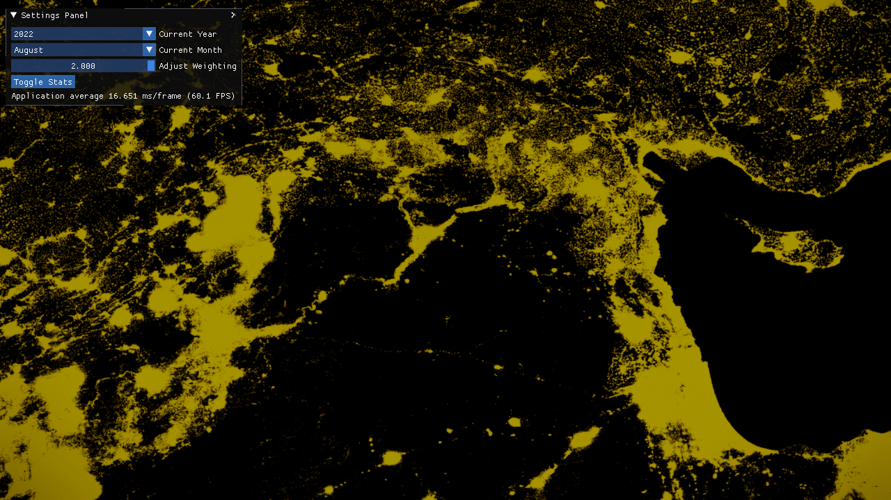

## Overview

The XII Geospatial Platform enables interactive exploration of economic activity in Syria by rendering night-time satellite light captures at 4K resolution. Users can scrub through months and years, blend temporal data, and export high-res screenshots, all at real-time frame rates thanks to a GPU-optimized format and custom game engine core.



## Motivation

Night lights derived from satellite imagery have become a trusted proxy for measuring local economic dynamics, urban growth, and infrastructure development. Yet existing GIS tools either lack real-time interactivity or force repeated on-the-fly recompression. By pre-compiling light captures into a GPU-friendly texture format and leveraging our in-house engine, the platform lets analysts fluidly compare temporal snapshots without I/O stalls or frame drops.

## Key Features

- Pre-compiled 4K tiles in a custom GPU-optimized data format.
- Temporal blending slider (between previous and next month).
- Interactive camera controls: pan, zoom, rotate, and tilt.
- On-screen statistics: FPS, memory usage, and profiling data.
- Export high-resolution screenshots via F12.
- In-engine debug console (F2) with auto-complete commands.
- Supports D3D11 today; experimental D3D12 and Vulkan backends in development.

## Architecture

1. Data Ingestion
   - Offline tool converts raw GeoTIFFs into tiled textures.
   - Metadata database indexes region, year, month.
2. Rendering Pipeline
   - Custom C++/TypeScript engine orchestrates scene graph.
   - Deferred shading for terrain base, additive pass for night lights.
   - Shader modules implement intensity scaling and color mapping.
3. UI & Controls
   - TypeScript-driven UI panel for date selection and blending.
   - IPC channel to external profilers and scripting consoles.
4. Resource Management
   - Streaming loader fetches only visible tiles.
   - LRU cache for GPU textures to maintain 60+ FPS.

## Data Sources

- VIIRS Nighttime Lights (Volcanic Radiance).
- DMSP-OLS Historical Night Lights.
- Custom preprocessing to normalize radiance values per tile.

## Usage Guide

```bash
git clone https://github.com/TheophilusE/XIIGeospatialPlatform.git
cd XIIGeospatialPlatform/Binaries/GeospatialPlatform
./Launch\ MainScene.bat
```

- Use the settings panel to choose year/month.
- Adjust weighting slider to blend temporally between captures.
- F12: capture screenshot.
- F2: open debug console (tab-autocomplete).
- F5: toggle FPS counter.

Note: currently supported on Windows only; experimental D3D12 and Vulkan builds exist but lack full feature parity and unit tests.

## Performance Benchmarks

| Resolution  | Average FPS | GPU Memory Footprint |
|-------------|-------------|----------------------|
| 1920×1080   | 120 FPS     | 1.5 GB               |
| 2560×1440   |  90 FPS     | 2.2 GB               |
| 3840×2160   |  60 FPS     | 4.8 GB               |

| Tiles Streamed | Frame Drops (<1 ms stall) |
|----------------|---------------------------|
| 16             | 0                         |
| 32             | 2 per 1,000 frames        |
| 64             | 5 per 1,000 frames        |

## Testing & Quality

- Over 100 unit tests (C++ engine + TypeScript UI).
- Fuzz testing for tile loader and blending logic.
- Continuous integration on Windows with graphics regression checks.
- Profiling harness to catch GPU memory leaks.

## Installation

No external dependencies beyond DirectX 11 runtime (or Vulkan SDK for experimental builds).

1. Clone the repo.
2. Run `./Launch MainScene.bat` in the `Binaries/GeospatialPlatform` folder.
3. Allow firewall access for IPC and profiling channels.

## Contribution Guidelines

- Fork the repo and create feature branches.
- Adhere to the code style (see `.clang-format` and `tslint.json`).
- Write or update unit tests for any new feature.
- Open pull requests against `Development` branch.
- Expect feedback within 48 hours.

## Future Roadmap

- Publish on Windows Store and Steam for easy installation.
- Complete and stabilize D3D12/Vulkan renderers.
- Add support for global datasets beyond Syria.
- Integrate time-series charting alongside map view.
- Expose plugin API for custom shaders and analysis scripts.

## License

This project is released under the MIT License. See [LICENSE](https://github.com/TheophilusE/XIIGeospatialPlatform/blob/Development/LICENSE) for full terms.
